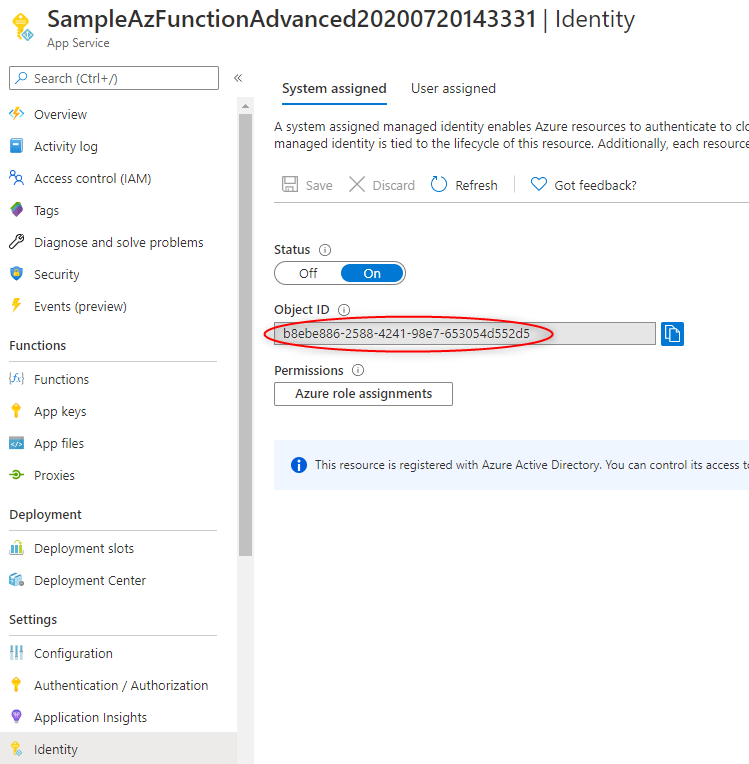
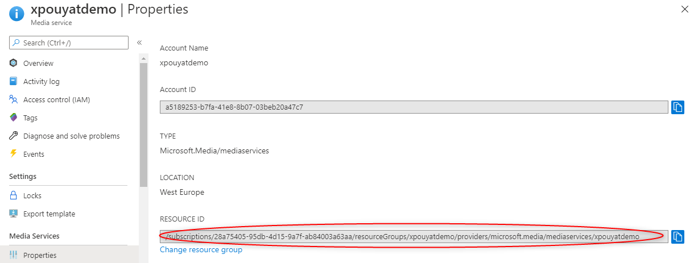
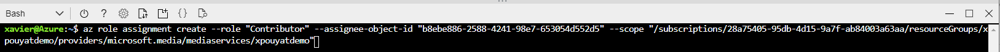
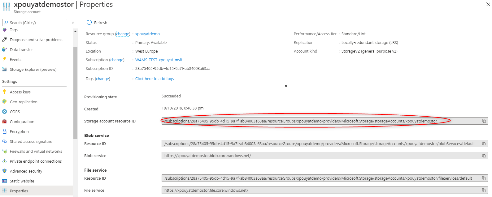

# How to add roles using Bash shell with Azure CLI

Retrieve the Identity object ID of the Azure function instance that you deployed in Azure.



Get the ID of the Media Services that the function will access.



Then run the AZ Cli command to authorize your Azure functions to access the AMS account :




```bash
az role assignment create --role "Contributor" --assignee-object-id "b8ebe886-2588-4241-98e7-653054d552d5" --scope "/subscriptions/28a75405-95db-4d15-9a7f-ab84003a63aa/resourceGroups/xpouyatdemo/providers/microsoft.media/mediaservices/xpouyatdemo"
```

Get the ID of the Azure Storage acount(s) to be acccessed by Azure functions.



And then provide "Storage Blob Data Contributor" and "Reader and Data Access" roles.

```bash
az role assignment create --role "Storage Blob Data Contributor" --assignee-object-id "b8ebe886-2588-4241-98e7-653054d552d5" --scope "/subscriptions/28a75405-95db-4d15-9a7f-ab84003a63aa/resourceGroups/xpouyatdemo/providers/Microsoft.Storage/storageAccounts/xpouyatdemostor"

az role assignment create --role "Reader and Data Access" --assignee-object-id "b8ebe886-2588-4241-98e7-653054d552d5" --scope "/subscriptions/28a75405-95db-4d15-9a7f-ab84003a63aa/resourceGroups/xpouyatdemo/providers/Microsoft.Storage/storageAccounts/xpouyatdemostor"
```

This should provide the needed rights for your Azure functions.
