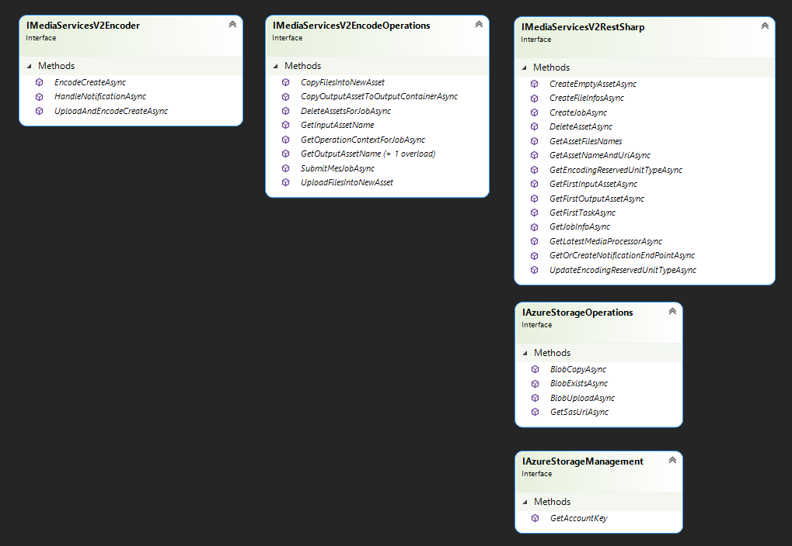
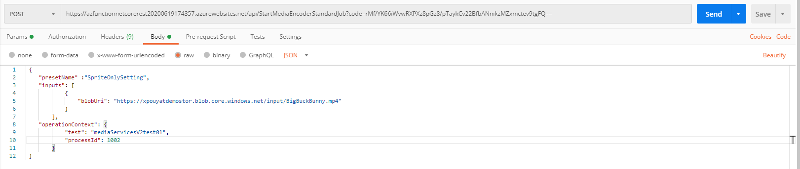
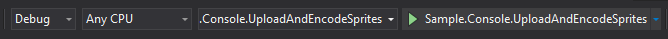
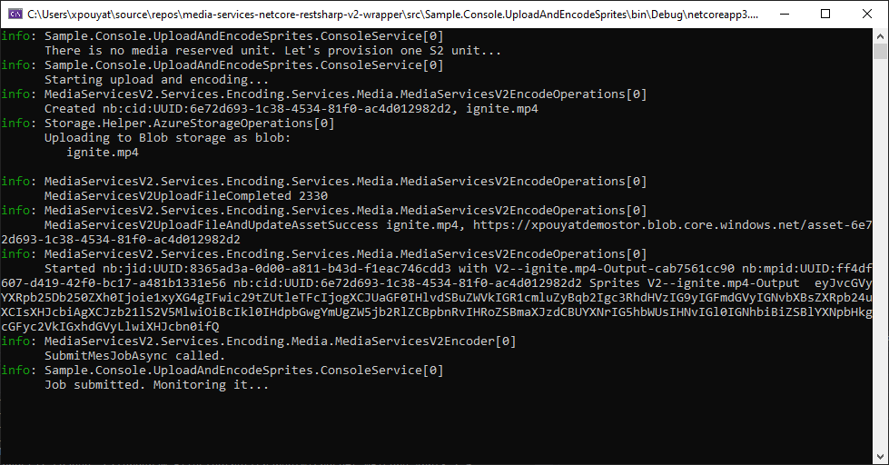

# Azure Media Services V2 REST API example using RestSharp in a .NetCore 3.1 Azure Function

Azure Media Services does not have a .NetCore SDK for their legacy (V2) API.  This project aims to provide some patterns and sample code to access the V2 REST API by using the popular RestSharp library.  It also provides yml pipelines, storage access services, demonstrates dependency injection in Azure Functions, as well as setting up RBAC for a MSI.

## About the solution

This sample contains a number of Azure Functions which demonstrate simple concepts:

**\src\Sample.AzFunction.HelloWorld :**

- GetJobById is an easy-to-read GET call to Media Services using RestSharp.
 
 **\src\Sample.AzFunction.Advanced :**
 
 - StartMediaEncoderStandardJob uses a collection of services to start and track a job with MediaServices, read in detail below.
 \src\Sample.AzFunction.Advanced

 - GetStorageAccountKey and GetContentLength demonstrate typical Azure service operations needed when building media solutions.
\src\Sample.AzFunction.Advanced

**\src\Sample.Console.UploadAndEncodeSprites :**

This sample contains a console app that uploads a MP4 file, encodes it using the Sprite preset, and wait for the job completion. 

## What this solution is not

The IMediaServicesV2RestSharp is not exhaustive, it only includes those API calls needed to perform the work in this sample.  It is easy to fork and extend, see contribution guidelines and licensing files.

## Authentication and Authorization

### Deployed in Azure

The ServiceCollectionExtensions include both AddAzureFluentManagement and AddDefaultAzureTokenCredential to set up the auth for the project.
When deployed to Azure as a Function App, with system assigned managed identity enabled, the web-host will provide the required credentials for both IAzure and TokenCredential objects; which are injected into the service container and used in the implementations.
This managed service principal must have appropriate role based access control to the storage accounts it needs to access via the code sample, and access to the media services resource.

The following are needed to access storage:
 - Storage Blob Data Contributor
 - Reader and Data Access

The following is needed for AMS:
 - Contributor on the AMS resource.

Run the script 'create_rbac_for_object_id.sh' once from a shell.azure.com instance, or a bash shell with the Azure CLI tooling, to permit the application.

### Running locally the Azure functions or the console app

From the template, create a local.settings.json file (for Azure Functions) or a appsettings.json file (for the console app) and set **AZURE_TENANT_ID** and **AZURE_SUBSCRIPTION_ID**. These will allow for the local user to log in interactively and use their identity for Azure operations, ensure they have sufficient privilege.

## Details on StartMediaEncoderStandardJob

The function and the console app uses an instance of IMediaServicesV2Encoder to start a job with a number of parameters.  That encoder performs several operations to support that request.  Those operations are implemented in IMediaServicesV2EncodeOperations.  In turn the EncodeService calls into the Azure Media Services API via the IMediaServicesV2RestSharp, it also uses IAzureStorageOperations and IAzureStorageManagement for it's storage interactions.

## StartMediaEncoderStandardJob function call

To test the StartMediaEncoderStandardJob function:
- copy a mp4 file into a Azure storage account,
- call the StartMediaEncoderStandardJob function from Curl or Postman. Please specify the path of the mp4 file in the *blobUri* parameter. 

Curl command line is at the end of [StartMediaEncoderStandardJob.cs](./src/Sample.AzFunction.Advanced/Functions/StartMediaEncoderStandardJob.cs)

Postman :

## How to run the console app

In Visual Studio, select *Sample.Console.UploadAndEncodeSprites* project and run it. An mp4 file is provided and will be uploaded by the app.

