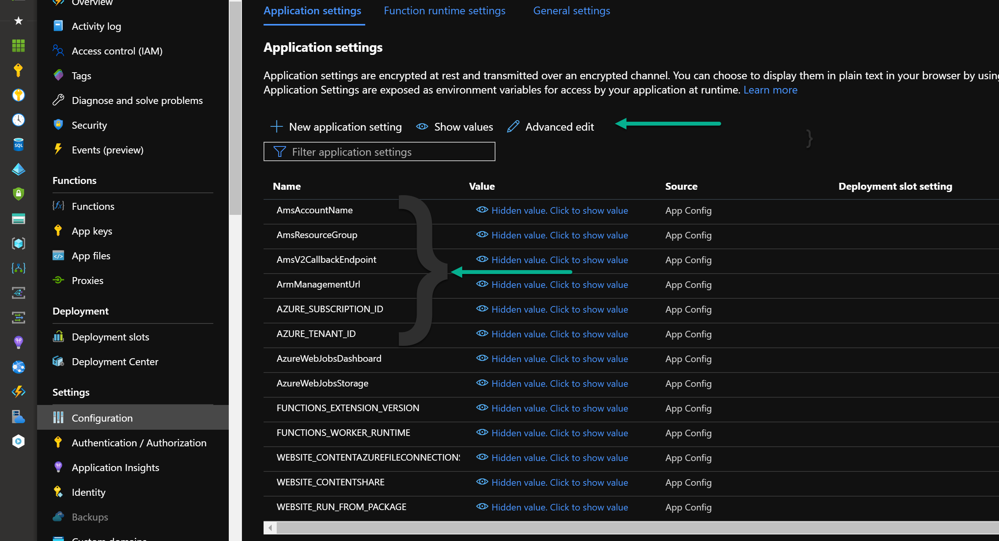

# This sample has been deprecated

## **Important : The Media Services v2 SDK is deprecated and will be retired after 29 February 2024.** Please migrate to Azure Media Services v3 API. For functions and logic apps samples using the v3 API, please go [to this repo](https://aka.ms/ams3functions).

The project includes several folders of sample Azure Functions for use with Azure Media Services v2 that show workflows related
to ingesting content directly from blob storage, encoding, and writing content back to blob storage. It also includes examples of
how to monitor job notifications via WebHooks and Azure Queues.

## IMPORTANT! Update your Azure Media Services REST API and SDKs to v3 by 29 February 2024

Because version 3 of Azure Media Services REST API and client SDKs for .NET and Java offers more capabilities than version 2, we’re retiring version 2 of the Azure Media Services REST API and client SDKs for .NET and Java. We encourage you to make the switch sooner to gain the richer benefits of version 3 of Azure Media Services REST API and client SDKs for .NET and Java. Version 3 provides: 

### Action Required:
To minimize disruption to your workloads, review the migration guide to transition your code from the version 2 to version 3 API and SDK before 29 February 2024. 

After 29 February 2024, Azure Media Services will no longer accept traffic on the version 2 REST API, the ARM account management API version 2015-10-01, or from the version 2 .NET client SDKs. This includes any 3rd party open-source client SDKS that may call the version 2 API.  

See [Update your Azure Media Services REST API and SDKs to v3 by 29 February 2024](https://azure.microsoft.com/en-us/updates/update-your-azure-media-services-rest-api-and-sdks-to-v3-by-29-february-2024)


# Azure Media Services V2 REST API samples using RestSharp in .NetCore 3.1

Azure Media Services (AMS) does not have a .NetCore SDK for their legacy (V2) API.  This project aims to provide some patterns and sample code to access the V2 REST API by using the popular RestSharp library.  It also provides a yml build pipeline, storage access services, demonstrates dependency injection in Azure Functions and Console app, as well as setting up RBAC for a MSI.

> Note : it is recommended to use AMS v3 REST API when possible. AMS v2 REST API still provides some features which are not yet in v3. [This document](https://docs.microsoft.com/en-us/azure/media-services/latest/media-services-v2-vs-v3#feature-gaps-with-respect-to-v2-apis) describes the feature gaps. You may also read the [v2 to v3 migration document](https://docs.microsoft.com/en-us/azure/media-services/latest/migrate-from-v2-to-v3).

## About the solution

This sample contains a number of Azure Functions and a console app which demonstrate simple concepts:

**\src\Sample.AzFunction.HelloWorld :**

- Function 'GetJobById' is an easy-to-read GET call to Media Services using RestSharp. More [here](./src/Sample.AzFunction.HelloWorld/readme.md).

 **\src\Sample.AzFunction.Advanced :**

- Function 'StartMediaEncoderStandardJob' uses a collection of services to start and track a job with MediaServices, read in detail below.
 \src\Sample.AzFunction.Advanced

- Functions 'GetStorageAccountKey' and 'GetContentLength' demonstrate typical Azure service operations needed when building media solutions.
\src\Sample.AzFunction.Advanced

**\src\Sample.Console.UploadAndEncodeSprites :**

- This console app sample uploads a MP4 file, adds a S2 media reserved unit, encodes it using the Sprite preset, waits for the job completion and then releases the S2 media reserved unit.

## What this solution is not

The IMediaServicesV2RestSharp is not exhaustive, it only includes those API calls needed to perform the work in this sample.  It is easy to fork and extend, see [contribution guidelines](./CONTRIBUTING.md) and [licensing](./LICENSE.md) files.

## Authentication and Authorization

### When deployed in Azure

The ServiceCollectionExtensions include both AddAzureFluentManagement and AddDefaultAzureTokenCredential to set up the auth for the project.

When deployed to Azure as a Function App, with system assigned managed identity enabled, the web-host will provide the required credentials for both IAzure and TokenCredential objects; which are injected into the service container and used in the implementations.

This managed service principal must have appropriate role based access control to the storage accounts it needs to access via the code sample, and access to the media services resource.

The following are needed to access storage:

- Storage Blob Data Contributor
- Reader and Data Access

The following is needed for AMS:

- Contributor on the AMS resource.

Run some commands from a shell.azure.com instance, or a bash shell with the Azure CLI tooling, to permit the application.

Follow [this detailed example on how to add these roles](./AddRoles.md).

Read the [HelloWorld readme.md](./src/Sample.AzFunction.HelloWorld/readme.md) to review authentication flow.

#### Azure Function application settings

Add the following application settings :

- **AZURE_TENANT_ID**
- **AZURE_SUBSCRIPTION_ID**
- **ArmManagementUrl**
- **AmsAccountName**
- **AmsResourceGroup**
- **AmsV2CallbackEndpoint**



Use "Advanced edit" mode and add :

```json
{
  "name": "ArmManagementUrl",
  "value": "https://management.azure.com",
  "slotSetting": false
},
{
  "name": "AmsAccountName",
  "value": "<< Put your azure media services account name here. >>",
  "slotSetting": false
},
{
  "name": "AmsResourceGroup",
  "value": "<< Put your azure media services account resource group name here. >>",
  "slotSetting": false
},
{
  "name": "AmsV2CallbackEndpoint",
  "value": "<< Put your azure media services callback endpoint here. e.g https://my.service.com/amsv2statusendpoint or an empty sting when not using a callback endpoint.>>",
  "slotSetting": false
},
{
  "name": "AZURE_SUBSCRIPTION_ID",
  "value": "<< Put your Subscription Guid here. >>",
  "slotSetting": false
},
{
  "name": "AZURE_TENANT_ID",
  "value": "<< Put your Tenant Guid here. >>",
  "slotSetting": false
}
```

### Running locally the Azure functions or the console app

From the template, create a local.settings.json file (for Azure Functions) or a appsettings.json file (for the console app) and set

- **AZURE_TENANT_ID**
- **AZURE_SUBSCRIPTION_ID**
- **ArmManagementUrl**
- **AmsAccountName**
- **AmsResourceGroup**

These will allow for the local user to log in interactively and use their identity for Azure operations, ensure [they have sufficient privilege](./AddRoles.md).

## Interfaces

The function and the console app uses an instance of IMediaServicesV2Encoder to start a job with a number of parameters.  That encoder performs several operations to support that request.  Those operations are implemented in IMediaServicesV2EncodeOperations.  In turn the EncodeService calls into the Azure Media Services API via the IMediaServicesV2RestSharp, it also uses IAzureStorageOperations and IAzureStorageManagement for it's storage interactions.


## How to call the StartMediaEncoderStandardJob function

To test the StartMediaEncoderStandardJob function:

- copy a mp4 file into a Azure storage account,
- call the StartMediaEncoderStandardJob function from Curl or Postman. Please specify the path of the mp4 file in the *blobUri* parameter.

Curl command line is at the end of [StartMediaEncoderStandardJob.cs](./src/Sample.AzFunction.Advanced/Functions/StartMediaEncoderStandardJob.cs)

Postman :


## How to run the console app

In Visual Studio, select *Sample.Console.UploadAndEncodeSprites* project and run it. An mp4 file is provided and will be uploaded by the app.


